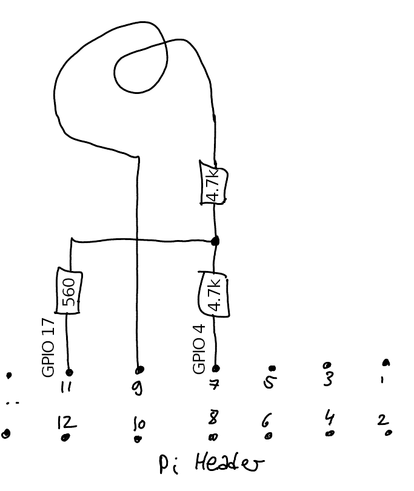
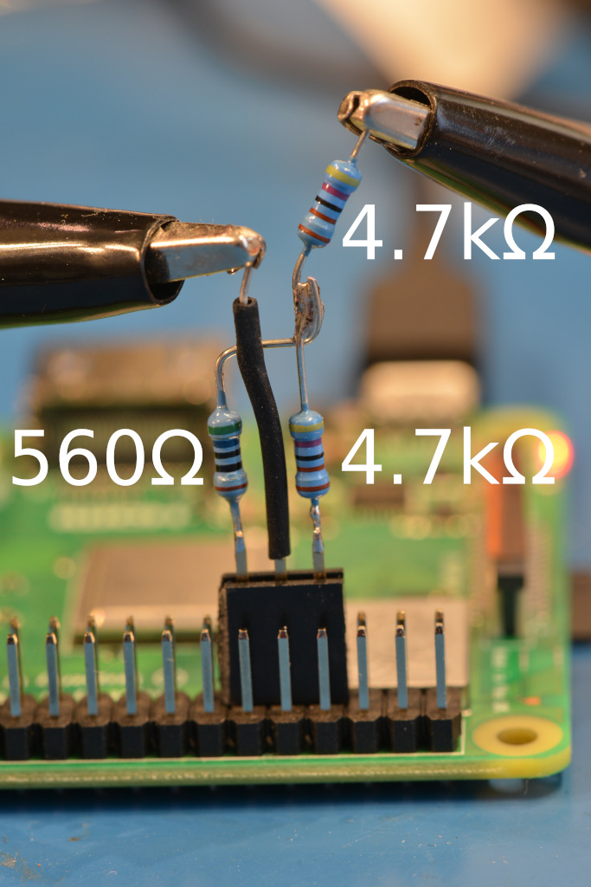
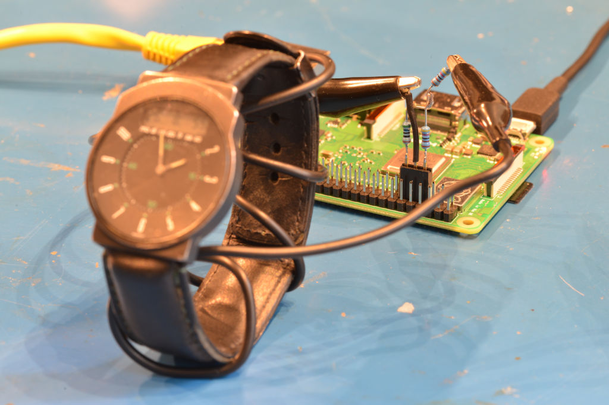
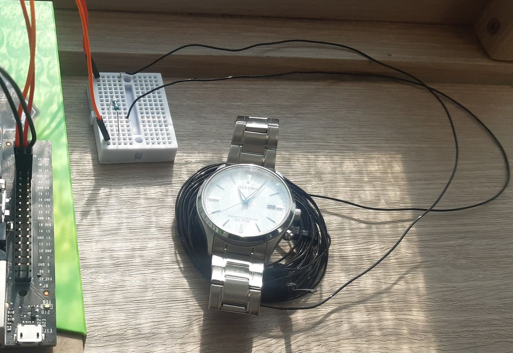
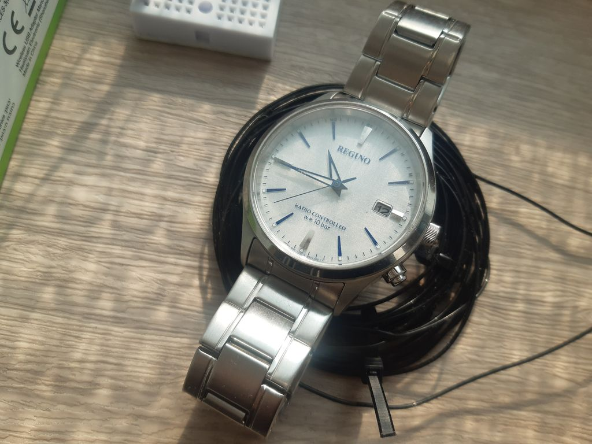
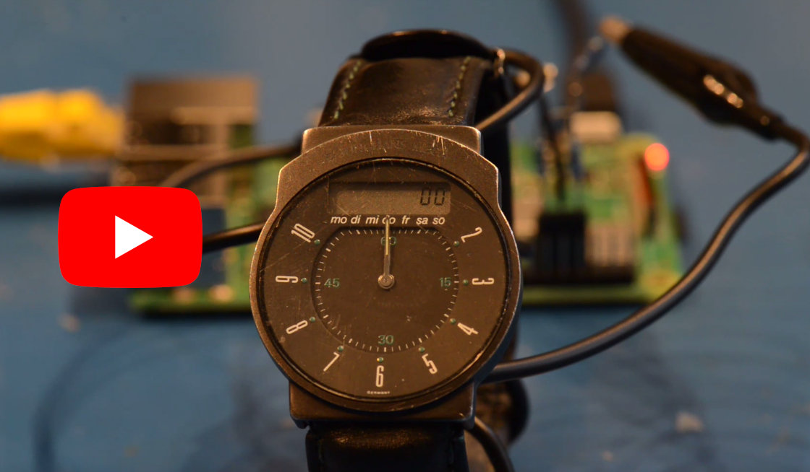
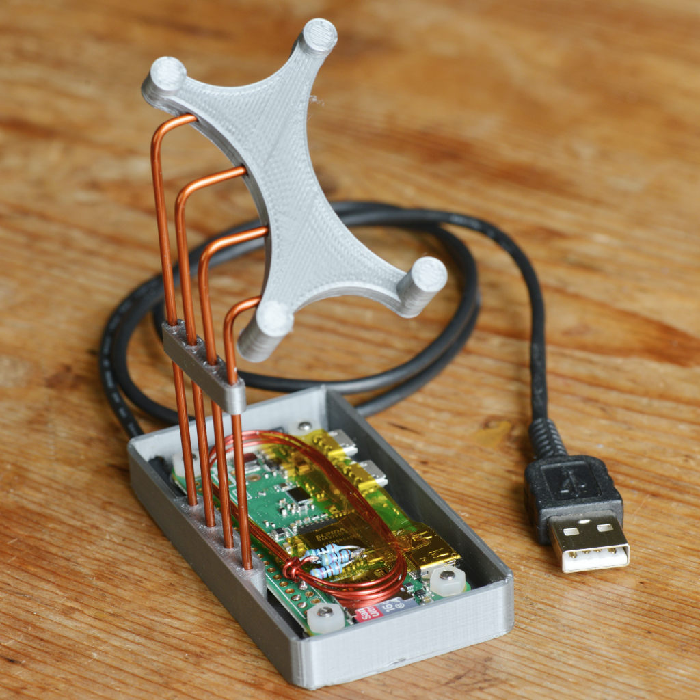
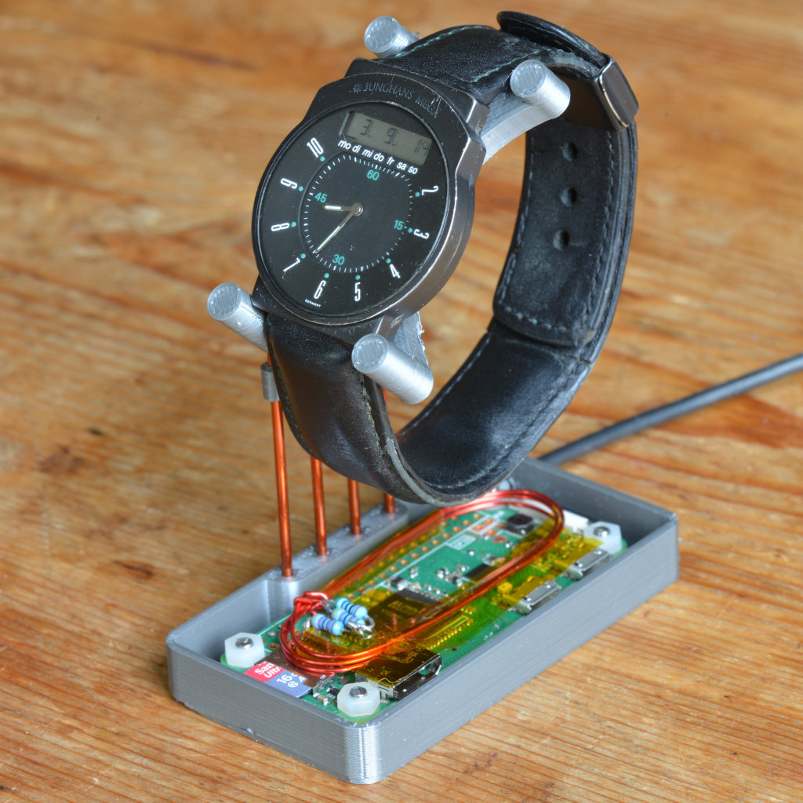

Radio time station transmitter using the Raspberry Pi and Nvidia Jetson
=====================================================

I am living in a country where there is no [DCF77] sender nearby for my
European radio controlled wristwatch to get its time. This vintage
Junghans Mega doesn't have any buttons to set the time, so to bring it back to
life, I built my own 'transmitter', taking the [NTP] time of a Raspberry Pi
and generating a modulated signal via GPIO pins to then magnetically couple
it into the watch ferrite.

Since many other long-wave time stations around the world use similar
concepts of sending amplitude modulated time, other time services have been
added.

This program is useful if you have a clock that otherwise does not get any
reception. This magnetical coupling is very low power and only works over a few
centimeters, but **_before running this program, make sure you follow your
local laws with regard to restrictions on radio transmissions._**

### Platform
txtempus supports Raspberry Pi series and Nvidia Jetson Series (experimental).

#### Raspberry Pi
So far, it has been tested on a Pi3 and a
Pi Zero W. There has been a report of different frequencies generated with
an older Pi (Bug #1), so until we have a definitive list of available
clock sources inside these, check out that bug for a workaround.

#### Nvidia Jetson Series (experimental)
So far, it has been tested only on a Jetson Nano,
but all Jetson devices except for TX1 and TX2 (there is no available pwm pin) are supported.


### Supported Time Services
#### DCF77
The [DCF77] (Germany) signal is a 77.5kHz carrier, that is amplitude modulated
with attenuations every second of the minute except the 59th to synchronize.
The length of the attenuation (100ms and 200ms) denotes bit values 0 and 1
respectively so in each minute, 59 bits can be transferred, containing
date and time information.

The Raspberry Pi has ways to create frequencies by integer division and
fractional jitter around that, which allows us to generate a frequency
of 77500.003Hz, which is close enough. Can be chosen with `-s DCF77` option.

#### WWVB
The [WWVB] (USA) is on a 60kHz carrier, and also transmits one bit per second
with different attenuation times (200ms zero, 500ms one; 800ms sync) and
multiple synchronization bits. Use `-s WWVB` option for this one.

#### MSF
The [MSF] (United Kingdom) has yet another encoding, transferring two bits
per second. Carrier is 60kHz. Option is `-s MSF`.

#### JJY
The [JJY] (Japan) is similar to WWVB, with same timings of carrier switches,
but reversed power levels. Some bits are different. Two senders exist in Japan
with 40kHz and 60kHz carrier; their simulations can be chosen
with command line options `-s JJY40` and `-s JJY60`.
If you're in/or want to display a different time-zone, issue
[#17](https://github.com/hzeller/txtempus/issues/17) might be of interest to
you.

### Minimal External Hardware
#### Raspberry Pi
The external hardware is simple: we use the frequency output on one pin and
another pin to pull the signal to a lower level for the regular attenuation.

To operate, you need three resistors: 2x4.7kΩ and one 560Ω (precision not
critical), wired to GPIO4 and GPIO17 like so:

Schematic                      | Real world
-------------------------------|------------------------------
   |


GPIO4 and 17 are on the inner row of the Header pin, three pins inwards on
the [Raspberry Pi GPIO]-Header.

You don't need GPIO17 and the 560Ω resistor for `MSF`, as that works with
switching the signal (on-off keying) instead of attenuating. In that case, you
can replace the sequence of two 4.7kΩ resistors with a single 10kΩ.

Now, wire a loop of wire between the open end of the one 4.7kΩ and ground - this
loop acts as coupling coil to the watch ferrite antenna.
The signal is very weak, so bring this wire-loop close to your radio
watch/clock.

In the following image, which was the first experiment, it is wrapped around
the antenna, but it is not strictly needed: anything within a few centimeters
should work.



Being too close to the clock can confuse a sensitive receiver, so you might need
to experiment with the distance. If your clock/watch is not receiving, add more
turns to your transmission coil. In the picture at the bottom of the page
you see that I am using about 10-20 turns on the coil (reddish oval lying on
the Pi).

This set-up should work for most watches if you have them in close vicinity.

The antenna set-up is intentionally not optimal to just be good enough for
a local watch but hopefully not causing interference.
Further improvements of course can be done to the antenna for increased
transmission distance, such as using a ferrite, making it an LC circuit or
adding an amplifier. *Only go in this direction after familiarizing yourself
with allowances of radio transmissions in your area on your frequency of
interest.*

#### Nvidia Jetson Series (experimental)
(*Please read the external hardware for the Raspberry Pi above first.)
On Jetson, the external hardware setup is slightly different from the Raspberry Pi.

We need one "PWM Pin" for a frequency output, and one "Attenuation Pin" for modulating the signal.
These pins vary by the Jetson model. Please check the following table.

|Devices|PWM pin (Board numbering)|Attenuation pin (Board numbering)|
|-------|-------------------------|---------------------------------|
|Jetson TX1, Jetson TX2|Not supported|Not supported|
|Jetson Xavier, Clara AGX Xavier|18|16|
|Other devices|33|35|

To operate, you need three resistors: 2x4.7kΩ and one 560Ω (precision not
critical) and one NPN transistor (nearly any NPN transistor should work. I'm using KTC3198).

Here's the full schematic of the external hardware for the Jetson Series:
Schematic                      | Real world (Jetson Nano)
-------------------------------|------------------------------
   |

Like the Raspberry Pi, you don't need the Attenuation Pin and the 560Ω resistor for `MSF`,
and a wire-loop between the 4.7kΩ register and the ground acts as coupling coil. Bring this wire-loop close to your radio
watch/clock.



### Build
```
 sudo apt-get install git build-essential -y
 git clone https://github.com/hzeller/txtempus.git
 cd txtempus
 mkdir build && cd build
```

#### Rapberry Pi
```
 cmake .. # or cmake .. -DPLATFORM=rpi
 make
```

#### Nvidia Jetson Series (experimental)
Before you build txtempus on your Jetson:
- You should install [JetsonGPIO](https://github.com/pjueon/JetsonGPIO) which is a library that enables the use of Jetson's GPIOs.
- The system pinmux must be configured to connect the hardware PWM controlller(s) to the relevant pins. Read the L4T documentation for details on how to configure the pinmux.

```
 cmake .. -DPLATFORM=jetson
 make
```

### Transmit!

```
 sudo ./txtempus -v -s DCF77
```

With `-s`, you set the type of time signal you want to transmit.

There are a few options you can set. The `-r` option is useful to have the
program run only for the few minutes it might take for a clock to synchronize.

By default, the current system time is transmitted. The `-t` option allows
different times for testing.

```
usage: ./txtempus [options]
Options:
        -s <service>          : Service; one of 'DCF77', 'WWVB', 'JJY40', 'JJY60', 'MSF'
        -r <minutes>          : Run for limited number of minutes. (default: no limit)
        -t 'YYYY-MM-DD HH:MM' : Transmit the given local time (default: now)
        -z <minutes>          : Transmit the time offset from local (default: 0 minutes)
        -v                    : Verbose.
        -n                    : Dryrun, only showing modulation envelope.
        -h                    : This help.
```

#### Don't connect monitor (Raspberry Pi)

Don't connect a monitor to the Pi, just operate it headless.

The internal oscillator used is also used for HDMI in the Rasbperry Pi; it will
be changing its frequency if a monitor is connected and the transmission will
fail. There should probably be a flag added to generate the frequency from
an alternative oscillator instead; but until that is implemented, just don't
connect a monitor and it will work. See the [very wrong frequency] bug
for details.

#### Action video - watch a watch synchronize

In the video below, you can see how a watch is set with this set-up.
After it is manually reset, it waits until it sees the end-of-minute mark
(which does not have any amplitude modulation) and then starts to count on from
second 59, then gathering the data that is following.

An interesting observation: you see that the watch already gets into fully
set mode after about 50 seconds, even though there is the year data
after that. This particular watch never shows the year, so it just ignores that.

<p align="center"><a href="https://youtu.be/WzZnGimRj60">
  </a></p>

### Showing the modulation envelope

Mostly for understanding the protocol, the `-n` option allows to observe how
the amplitude modulation of each second looks like.
Unlike the regular transmission, don't need to be root or run on the
Raspberry Pi to use this option.
Underscores (`_`) show low power carrier, hashes (`#`) high power:

```
$ ./txtempus -n -s wwvb
2018-08-17 13:22:00 -> tx-modulation
:00 [________##]
:01 [__########]
:02 [_____#####]
:03 [__########]
:04 [__########]
:05 [__########]
:06 [__########]
:07 [_____#####]
:08 [__########]
:09 [________##]
:10 [__########]
:11 [__########]
  ... and so on for the whole minute ...
```

### Limitations
In some of these protocols, there are additional bits that contain
information about upcoming daylight saving times, leap seconds or difference
to astronomic time. These are currently not set, but usually clocks are fine
with it.

Some time stations also phase-modulate their carrier, txtempus does not.

The frequency generation does **not** seem to **work** on a **Raspberry Pi4**.
Please use older Pis for now until that is figured out (also pull requests
accepted if you know details).

### Installation

#### Software
After building, you can install the binary in some standard location

```
 sudo make install
```

#### Watch holder
Each set-up will be different. In my case, I need my DCF77 radio
watch getting set over night. So I built this watch holder that presents the
watch upright while the antenna (in the wristband) is close to the
'transmission coil' that is lying flat on the Pi. The bottom of the 3D printed
case is filled with lead shot in epoxy to provide a stable base.

The Raspberry Pi Zero W runs ntpd, PLL locking the system time to various
stratum 1 NTP servers keeping it at atomic time within ±50ms.
This particular watch only checks the radio twice a day at 2am and 3am, so
there is a cron-job that runs `txtempus` around these times for a few minutes.

#### Crontab

If you put the following line in your `/etc/crontab` txtempus will be started
at 1:57 and 2:57 at night and runs for 10 minutes.

```crontab
57 1,2    * * *   root    /usr/bin/txtempus -s DCF77 -r 10
```

(this requires that you have installed txtempus so that it can be found
in `/usr/bin` : `sudo make install`).

watch holder             | ... with watch
-------------------------|------------------------------
  |

<hr/>

**tx** _common telecommunication abbreviation for 'transmit'_<br/>
**tempus**, n _Latin. Time; period; age_

[DCF77]: https://en.wikipedia.org/wiki/DCF77
[WWVB]: https://en.wikipedia.org/wiki/WWVB
[JJY]: https://en.wikipedia.org/wiki/JJY
[MSF]: https://en.wikipedia.org/wiki/Time_from_NPL_(MSF)
[NTP]: https://en.wikipedia.org/wiki/Network_Time_Protocol
[Raspberry Pi GPIO]: https://www.raspberrypi.org/documentation/usage/gpio/
[very wrong frequency]: https://github.com/hzeller/txtempus/issues/1
